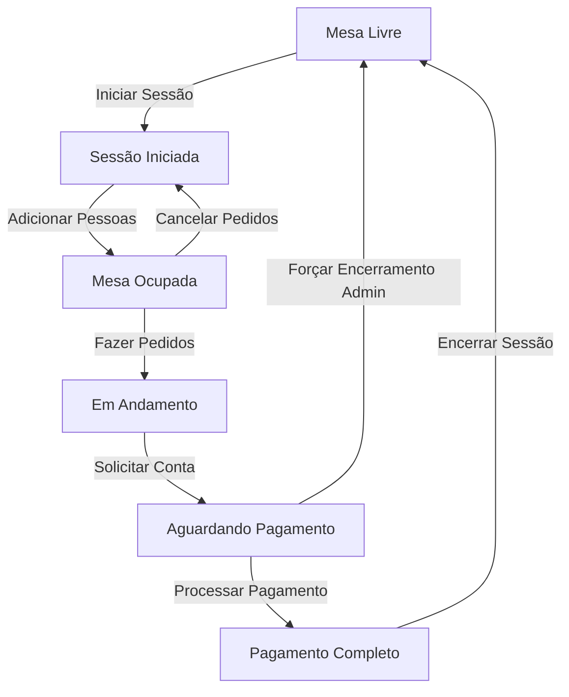

# 🔍 Análise Completa do Fluxo de Trabalho de Mesas

**Data:** 31 de Dezembro de 2025  
**Versão Atual:** Sistema com múltiplas iterações de checkout e gestão  
**Objetivo:** Analisar harmonia e consistência entre todos os componentes

---

## 📊 1. MAPEAMENTO COMPLETO DE COMPONENTES

### 1.1 Hierarquia de Componentes

```
📁 GESTÃO DE MESAS
├── 📄 pages/tables.tsx (Página Principal)
│   └── 🔧 TablesPanel.tsx (Painel de Gestão)
│       ├── 🎴 TableCard.tsx (Card individual)
│       └── 💬 TableDetailsDialog.tsx (Diálogo Principal) ⭐ COMPONENTE MASTER
│           ├── QuickOrderDialog.tsx (Pedido Rápido)
│           ├── CustomerSearchDialog.tsx (Busca Cliente)
│           ├── ConvertGuestDialog.tsx (Converter Guest)
│           ├── PrintGuestBill.tsx (Impressão)
│           └── SpeedDialMenu.tsx (Menu Rápido)
│
├── 📁 CHECKOUT (2 VERSÕES ATIVAS!)
│   ├── 📄 pages/table-checkout-v2.tsx ⭐ VERSÃO ATUAL
│   ├── 📄 pages/table-checkout-OLD.tsx ⚠️ VERSÃO ANTIGA
│   └── 🔧 components/tables/TableCheckoutDialog.tsx (Dialog em Open Tables)
│
└── 📁 AUXILIARES
    ├── table-dialog/TableDialogSplitPanel.tsx
    ├── BillSplitPanel.tsx
    ├── PaymentDialog.tsx
    └── PaymentForm.tsx
```

---

## 🔄 2. FLUXO DE CRIAÇÃO E GESTÃO DE MESAS

### 2.1 Ciclo de Vida Completo de uma Mesa



### 2.2 Estados Possíveis

| Estado | Descrição | Pode Fazer Pedidos | Tem Sessão Ativa |
|--------|-----------|-------------------|------------------|
| `livre` | Mesa disponível | ❌ Não | ❌ Não |
| `ocupada` | Cliente sentado | ✅ Sim | ✅ Sim |
| `em_andamento` | Servindo/Consumindo | ✅ Sim | ✅ Sim |
| `aguardando_pagamento` | Conta solicitada | ❌ Não | ✅ Sim |

### 2.3 Fluxo de Iniciar Sessão

**Componente:** `TableDetailsDialog.tsx` (linha 358-386)

```typescript
Endpoint: POST /api/tables/:id/start-session
Payload: { customerName?, customerCount }

Fluxo:
1. Usuário clica em "Iniciar Sessão"
2. Seleciona número de pessoas (1-4 ou customizado)
3. Backend cria sessão (storage.startTableSession)
4. Atualiza status da mesa automaticamente
5. Broadcast WebSocket para clientes conectados
6. Invalida queries:
   - /api/tables/with-orders
   - /api/tables/:id/guests
   - /api/tables/:id/orders-by-guest
```

**Validações:**
- ✅ Mesa não pode ter sessão ativa
- ✅ Apenas Admin pode iniciar sessão
- ✅ Customer count é opcional (padrão: 1)

---

## 👥 3. GESTÃO DE CONVIDADOS (GUESTS)

### 3.1 Três Tipos de Pessoas na Mesa

```typescript
1. 🔵 CONVIDADO ANÔNIMO
   - Sem vínculo com cliente
   - Nome opcional
   - Usado para divisão de conta

2. 🟢 CLIENTE EXISTENTE
   - Vinculado a registro existente
   - Ganha pontos de fidelidade
   - Histórico de compras

3. 🟡 CADASTRO RÁPIDO
   - Cria novo cliente (nome + telefone)
   - Automaticamente vinculado à mesa
   - Entra no sistema de fidelidade
```

### 3.2 Fluxo de Adicionar Pessoa

**Componente:** `TableDetailsDialog.tsx` (linha 427-517)

```typescript
Mutation: addPersonToTableMutation

Tipos:
- type: 'anonymous' → POST /api/tables/:id/guests { name? }
- type: 'existing' → POST /api/tables/:id/guests { customerId }
- type: 'quick' → POST /api/customers + POST /api/tables/:id/guests

Optimistic Update: ✅ Sim
Invalidações:
- /api/tables/:id/guests
- /api/tables/with-orders
```

**Diálogos Envolvidos:**
1. `showAddPersonModal` - Escolher tipo
2. `showCustomerSearch` - Buscar cliente
3. `addingGuest` - Convidado anônimo
4. `addPersonMode === 'quick'` - Cadastro rápido

### 3.3 Gestão de Pedidos por Convidado

**Endpoint Principal:** `GET /api/tables/:id/orders-by-guest`

```typescript
Estrutura de Resposta:
{
  ordersByGuest: [
    {
      guest: { id, name, customerId, ... },
      orders: [ /* pedidos com items */ ],
      subtotal: "1500.00"
    }
  ],
  anonymousOrders: [ /* pedidos sem guest */ ],
  totalAmount: "3000.00",
  paidAmount: "0.00"
}
```

**Usado em:**
- ✅ `TableDetailsDialog.tsx` (linha 327-335) - Visualização
- ✅ `table-checkout-v2.tsx` (linha 112-121) - Checkout
- ❌ `table-checkout-OLD.tsx` - NÃO USA (problema!)

---

## 💳 4. ANÁLISE DE CHECKOUT (CRÍTICO!)

### 4.1 Três Implementações Diferentes

#### A) `table-checkout-v2.tsx` ⭐ VERSÃO ATUAL

**Localização:** `client/src/pages/table-checkout-v2.tsx`  
**Rota:** `/tables/:id/checkout`  
**Status:** ✅ Ativo e usado

**Características:**
- ✅ Usa `orders-by-guest` endpoint
- ✅ Suporta divisão por convidado
- ✅ Múltiplos métodos de pagamento
- ✅ Serviços automáticos (taxa, couvert)
- ✅ Cupons e fidelidade
- ✅ Dialog de sucesso com impressão

**Fluxo:**
```typescript
1. Carrega dados: GET /api/tables/:id/orders-by-guest
2. Seleciona modo: Simples ou Por Convidado
3. Aplica descontos/serviços
4. Escolhe método de pagamento
5. Processa: POST /api/tables/:id/payment
6. Invalida queries e redireciona
```

**Query Keys Invalidadas:**
```typescript
- /api/tables
- /api/table-sessions
- table-orders (genérica)
- /api/tables/:id/guests
```

#### B) `table-checkout-OLD.tsx` ⚠️ VERSÃO ANTIGA

**Localização:** `client/src/pages/table-checkout-OLD.tsx`  
**Status:** ⚠️ Ainda existe mas não é usada na rota principal

**Problemas Identificados:**
- ❌ NÃO usa `orders-by-guest`
- ❌ Lógica de divisão diferente
- ❌ Pode causar confusão
- ⚠️ Deveria ser removida ou renomeada

**Recomendação:** 🗑️ REMOVER ou mover para `/archive`

#### C) `TableCheckoutDialog.tsx` (Dialog)

**Localização:** `client/src/components/tables/TableCheckoutDialog.tsx`  
**Usado em:** `pages/open-tables.tsx`  
**Status:** ✅ Ativo para checkout rápido

**Características:**
- ✅ Dialog modal (não página completa)
- ✅ Usa `orders-by-guest`
- ✅ Suporta checkout por convidado
- ⚠️ Implementação simplificada vs v2

### 4.2 Inconsistências Identificadas

```diff
❌ PROBLEMA 1: Duas versões de checkout
+ table-checkout-v2.tsx (ativa)
- table-checkout-OLD.tsx (não deveria existir)

❌ PROBLEMA 2: Query keys diferentes
TableDetailsDialog invalida: /api/tables/:id/orders-by-guest
Checkout v2 invalida: table-orders (genérica)
→ Pode causar dados dessinc ronizados

❌ PROBLEMA 3: Diálogo vs Página
TableCheckoutDialog (modal) tem menos features que v2 (página)
→ Usuário pode ter experiências diferentes

⚠️ PROBLEMA 4: Navegação confusa
Dois caminhos para checkout:
1. TableDetailsDialog → Botão Checkout → /tables/:id/checkout (v2)
2. open-tables.tsx → TableCheckoutDialog (modal)
```

---

## 🔄 5. SINCRONIZAÇÃO DE DADOS

### 5.1 Query Keys Principais

```typescript
MESAS:
- /api/tables                    // Lista todas
- /api/tables/with-orders        // Com dados de pedidos
- /api/tables/:id                // Detalhes

SESSÕES:
- /api/table-sessions
- /api/tables/:id/sessions

CONVIDADOS:
- /api/tables/:id/guests

PEDIDOS:
- /api/orders
- /api/tables/:id/orders-by-guest  // ⭐ PRINCIPAL
- table-orders                     // ⚠️ Genérica (evitar)

PAGAMENTOS:
- /api/tables/:id/payments
```

### 5.2 Invalidações Críticas

**Quando Iniciar Sessão:**
```typescript
✅ /api/tables/with-orders
✅ /api/tables/:id/guests
✅ /api/tables/:id/orders-by-guest
```

**Quando Adicionar Convidado:**
```typescript
✅ /api/tables/:id/guests
✅ /api/tables/with-orders
⚠️ Usa optimistic update
```

**Quando Fazer Checkout:**
```typescript
✅ /api/tables
✅ /api/table-sessions
⚠️ table-orders (genérica - melhorar)
✅ /api/tables/:id/guests
```

**Quando Encerrar Sessão:**
```typescript
✅ /api/tables/with-orders
❌ Falta: /api/tables/:id/orders-by-guest
```

---

## 🐛 6. PROBLEMAS E INCONSISTÊNCIAS IDENTIFICADOS

### 6.1 Críticos (Precisam correção imediata)

1. **❌ Versão OLD do Checkout existe**
   - Arquivo: `table-checkout-OLD.tsx`
   - Problema: Confunde desenvolvimento, não usa API correta
   - Solução: Remover ou mover para `/archive`

2. **❌ Query keys inconsistentes**
   - Problema: Alguns componentes invalidam `table-orders`, outros `/api/tables/:id/orders-by-guest`
   - Impacto: Dados podem ficar dessincronizados
   - Solução: Padronizar para sempre usar `/api/tables/:id/orders-by-guest`

3. **❌ Falta invalidação no encerramento de sessão**
   - Componente: `TableDetailsDialog.endSessionMutation`
   - Problema: Não invalida `orders-by-guest`
   - Impacto: Dados antigos podem aparecer
   - Solução: Adicionar invalidação

### 6.2 Médios (Melhorar UX)

4. **⚠️ Dois caminhos para checkout**
   - Dialog modal vs Página completa
   - Funcionalidades diferentes
   - Solução: Unificar ou documentar quando usar cada um

5. **⚠️ Optimistic updates apenas em guests**
   - Pedidos não têm optimistic updates
   - UI pode parecer lenta
   - Solução: Adicionar em operações de pedido

6. **⚠️ WebSocket broadcast não usado em todos os lugares**
   - Alguns mutations fazem broadcast, outros não
   - Solução: Padronizar uso de WebSocket

### 6.3 Menores (Polimento)

7. **ℹ️ Muitos estados locais em TableDetailsDialog**
   - 15+ estados diferentes
   - Complexidade alta
   - Solução: Considerar reducer ou extrair lógica

8. **ℹ️ Validações duplicadas**
   - Cliente e servidor validam as mesmas coisas
   - Solução: Centralizar validações compartilhadas

---

## ✅ 7. PONTOS FORTES DO SISTEMA ATUAL

### 7.1 Arquitetura Sólida

✅ **Separação de responsabilidades clara**
- Componentes bem divididos
- Mutations isoladas e reutilizáveis
- Backend com validações robustas

✅ **Gestão de estado moderna**
- React Query para cache
- Optimistic updates onde apropriado
- WebSocket para real-time

✅ **UX Rica**
- Atalhos de teclado
- Animações suaves (Framer Motion)
- Feedback visual constante

### 7.2 Features Avançadas

✅ **Gestão Híbrida de Clientes**
- Convidados anônimos
- Clientes existentes
- Cadastro rápido

✅ **Checkout Flexível**
- Pagamento simples ou dividido
- Múltiplos métodos
- Serviços automáticos

✅ **Validações Inteligentes**
- Impede fechar mesa com valores pendentes
- Valida transições de status
- Força encerramento para admin

---

## 🎯 8. RECOMENDAÇÕES

### 8.1 Ações Imediatas

1. **🗑️ Remover `table-checkout-OLD.tsx`**
   ```bash
   mv client/src/pages/table-checkout-OLD.tsx docs/archive/
   ```

2. **🔧 Padronizar query keys**
   ```typescript
   // Substituir todas ocorrências de:
   queryClient.invalidateQueries({ queryKey: ['table-orders'] });
   
   // Por:
   queryClient.invalidateQueries({ queryKey: [`/api/tables/${id}/orders-by-guest`] });
   ```

3. **➕ Adicionar invalidação faltante**
   ```typescript
   // Em TableDetailsDialog.endSessionMutation
   onSuccess: () => {
     queryClient.invalidateQueries({ queryKey: ['/api/tables/with-orders'] });
     queryClient.invalidateQueries({ queryKey: [`/api/tables/${table?.id}/orders-by-guest`] }); // ← ADD
     toast({ title: 'Sessão encerrada' });
   }
   ```

### 8.2 Melhorias de Médio Prazo

4. **📝 Documentar fluxos de checkout**
   - Quando usar Dialog vs Página
   - Diferenças de funcionalidade
   - Guia de decisão para desenvolvedores

5. **🔄 Unificar lógica de checkout**
   - Extrair lógica comum para hooks
   - Reduzir duplicação entre Dialog e v2

6. **📡 Padronizar WebSocket broadcasts**
   - Todas mutations relevantes devem fazer broadcast
   - Documentar eventos disponíveis

### 8.3 Refatorações Futuras

7. **🏗️ Refatorar TableDetailsDialog**
   - Considerar Context API para estado
   - Extrair diálogos para componentes separados
   - Reduzir complexidade do arquivo (2777 linhas!)

8. **🧪 Adicionar testes**
   - Testes de integração para fluxo completo
   - Testes unitários para mutations
   - Testes E2E para checkout

---

## 📋 9. CHECKLIST DE HARMONIA

### ✅ O que está funcionando bem

- [x] Fluxo de iniciar/encerrar sessão
- [x] Adicionar pessoas à mesa (3 modos)
- [x] Visualização de pedidos por convidado
- [x] Checkout v2 completo e funcional
- [x] Validações de encerramento
- [x] Optimistic updates em guests
- [x] Atalhos de teclado
- [x] Animações e UX

### ⚠️ O que precisa atenção

- [ ] Remover versão OLD do checkout
- [ ] Padronizar query keys
- [ ] Adicionar invalidação faltante
- [ ] Documentar dois caminhos de checkout
- [ ] Unificar lógica duplicada
- [ ] Padronizar WebSocket

### ❌ O que está problemático

- [ ] table-checkout-OLD.tsx ainda existe
- [ ] Query keys inconsistentes causam bugs potenciais
- [ ] Falta invalidação no endSession

---

## 🎬 10. CONCLUSÃO

### Estado Geral: 🟡 BOM, MAS PRECISA LIMPEZA

**Pontos Fortes:**
- ✅ Funcionalidade completa e rica
- ✅ Arquitetura moderna e escalável
- ✅ UX excelente com animações e feedback

**Pontos de Melhoria:**
- ⚠️ Limpeza de código legado (OLD)
- ⚠️ Padronização de invalidações
- ⚠️ Redução de complexidade

**Risco de Bugs:**
- 🟡 Médio - principalmente por query keys inconsistentes
- 🟢 Baixo - sistema tem validações robustas
- 🟡 Médio - versão OLD pode confundir manutenção

### Próximos Passos Recomendados:

1. **Hoje:** Remover `table-checkout-OLD.tsx`
2. **Esta Semana:** Padronizar query keys
3. **Próxima Sprint:** Refatorar TableDetailsDialog
4. **Q1 2026:** Adicionar testes automatizados

---

**Fim da Análise** ✨
